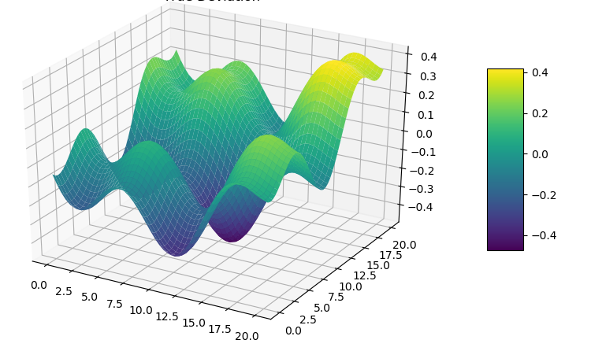

# Imperial_MlxAI-Capstone
Imperial Business School - Portfolio Project.

# Automated Gold Trading System

## High Level Explanation
This project is an automated trading system that predicts gold price movements using machine learning. It analyses real-time market data and technical indicators to make trading decisions. The system combines Random Forest and Gradient Boosting (ML Techniques) to identify profitable trading opportunities with risk management. A non-technical comparison can be made to an agent that has a watch on the gold market, actively looking for patterns, and suggests when to buy or sell whilst managing risk

## Data
- **Source**: Alpha Vantage API (Financial Data Provider)
- **Type**: 1-minute gold price data (GLD ETF)
- **Volume**: 19,067 price bars
- **Features**: 
  - Raw price data (Open, High, Low, Close, Volume)
  - 18 technical indicators
  - Binary target (price direction)
- **Split**: 70% training, 15% validation, 15% test

## Model
### Ensemble Approach
Combined two complementary models:
1. **Random Forest Classifier**
   - Great at handling non-linear relationships
   - Resistant to overfitting
   - Good feature importance insights

2. **Gradient Boosting Classifier**
   - Strong predictive performance
   - Handles imbalanced data well
   - Sequential learning from errors

This ensemble approach was chosen to balance accuracy with interpretability while maintaining real-time performance capabilities.

## Hyperparameter Optimisation

### Random Forest Parameters
- n_estimators: 100
- min_samples_split: 50
- min_samples_leaf: 30
- max_features: sqrt
- max_depth: 5

### Gradient Boosting Parameters
Grid search optimisation over:
- Learning rate: [0.01, 0.05, 0.1]
- Max depth: [3, 4, 5]
- Min samples split: [50, 100]
- Min samples leaf: [20, 30]
- Subsample: [0.7, 0.8, 0.9]

Optimisation metrics: ROC-AUC score with 5-fold cross-validation

## Results

### Classification Performance
- ROC AUC Score: 0.6576
- Average Prediction Confidence: 50.04%

### Trading Performance
- Win Rate: 63.93%
- Average P&L per Trade: $140.89
- Sharpe Ratio: 1.73

### Risk Analysis

- Mean return: -0.08%
- Standard deviation: 2.44%
- 95% VaR: -4.15%
- Average maximum drawdown: 2.97%

### Key Insights
1. Model performs best during regular market hours
2. Higher confidence thresholds improve trade quality
3. Risk management crucial for consistent returns
4. Technical indicators provide reliable signals
5. System requires periodic retraining

## Contact Details
- **Author**: Ibrahim Quasim
- **Email**: ibrahimqm@protonmail.com
- **Project Status**: Active Development
- **Last Updated**: June 2025